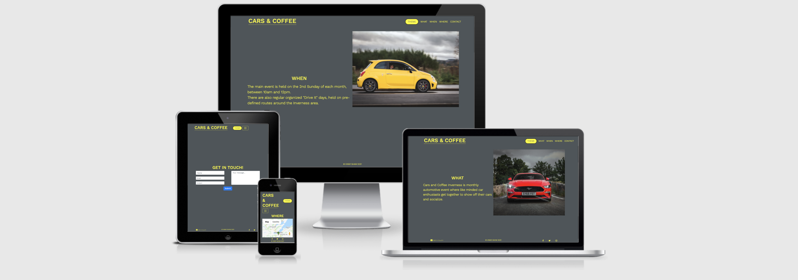
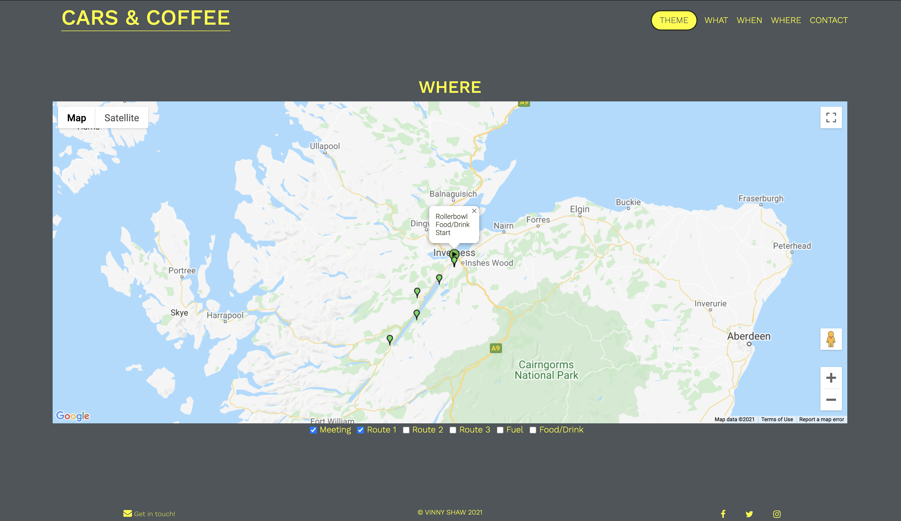
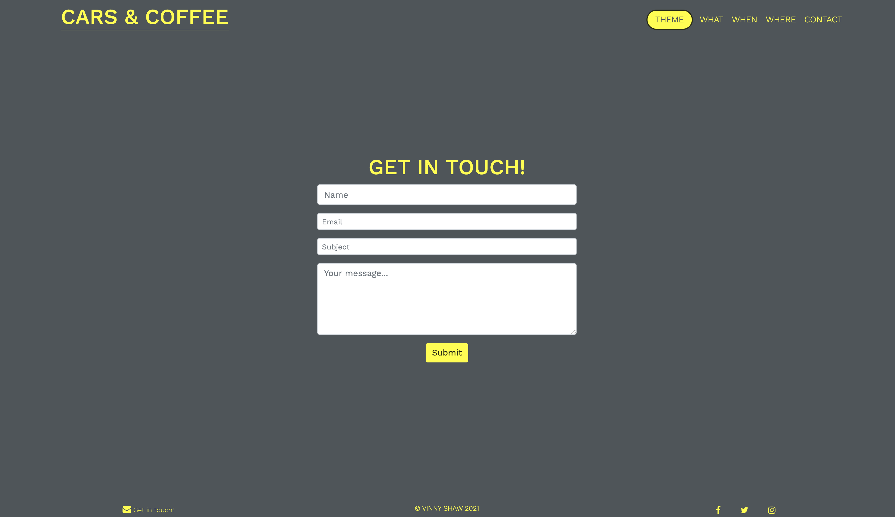

# CARS and COFFEE

Welcome to my Code Institute MS2 Project: Interactive Frontend Development.

An interactive website providing information for the regular automotive event **Cars and Coffee**, held in Inverness, Scotland.

## [Click to visit live demo site](https://vinnyshaw.github.io/cars-and-coffee-ci-ms2/#what)

## Table of contents

- [User Experience](https://github.com/VinnyShaw/cars-and-coffee-ci-ms2/blob/master/README.md#user-experience)
- [Features](https://github.com/VinnyShaw/cars-and-coffee-ci-ms2/blob/master/README.md#features)
- [Technologies Used](https://github.com/VinnyShaw/cars-and-coffee-ci-ms2/blob/master/README.md#technologies-used)
- [Testing](https://github.com/VinnyShaw/cars-and-coffee-ci-ms2/blob/master/README.md#testing)
- [Deployment](https://github.com/VinnyShaw/cars-and-coffee-ci-ms2/blob/master/README.md#deployment)
- [Credits](https://github.com/VinnyShaw/cars-and-coffee-ci-ms2/blob/master/README.md#credits)

## User Experience and Stories

The aim of this website is to allow the user to find information about the event and its activities.

- A user may wish to know the time and location of the event.
  - They can do this ny navigating to the WHEN and WHERE sections of the site.
- A user may wish to see a map detailing the the location of the event or any other planned activities.
  - They can do this by navigation to the WHERE section of the site and interacting with the the Google Maps API interface.
- A user may wish to easily contact the organizers of the event regarding attending or ask for additional information.
  - They can do this by navigation tho the CONTACT section of the site, filling out the contact form and submitting.
- A user may wish to find the events social media accounts and be able to follow a link to them.
  - They can do this by clicking the social media links in the footer section of the site.
- A user may wish to alter the colour scheme of the site between light and dark modes.
  - They can do this by interacting with the Theme Toggle switch in the sites header.

## [Click to visit Wireframes, mockups and screenshots](https://github.com/VinnyShaw/carsa-and-coffee-ci-ms2/blob/master/wireframes.md)

## Features

#### Existing

- **Navigation** - the header contains the Navigation and Theme toggle which allow users easily select the required site section and to change the theme.
  
- **Theme switching** - a toggle in the header will allow the user to switch between Light and Dark site themes. This operation is carried out by custom Javascript.
- **WHAT section** - allows users to learn about Cars and Coffee by reading a short description of the event.
- **WHEN section** - gives the user the date/time of the event or any additional activities.
- **WHERE section** - provides the user with the location of the event and any additional activities utilizing the Google Maps API.
  
- **CONTACT section** - allows the user to quickly contact the site owner by filling out and submitting a short form which will utilise [emailJS](https://www.emailjs.com/) to submit the contents of the completed form in an email to the event organizers.
  
- **Social media links** - the footer offers external links to the owners various social media accounts which will open in a new tab.
  
- **Contact link** - a user wishing to contact the owner, from any point of the site, can simply click the internal link to take them to the Contact section.

#### Future Options and Implementations

- **Gallery** - a gallery displaying photographs taken at the event could be added.
- **Theme** - a function to allow the users system preference to toggle the site theme could be added.
- **Routes** - polylines linking map location markers for routes could be added.
- **Google Maps** - an option to open the routes in Google Maps could be added.

## Technologies Used

- [HTML5](https://en.wikipedia.org/wiki/HTML5)
- The basic level elements of the site are built using this markup language.
- [CSS3](https://en.wikipedia.org/wiki/CSS)
  - The custom styling and responsive media queries are written in **CSS**.
- [Javascript](https://www.javascript.com)
  - The sites theme toggle, form submission and Google Maps API integration all use **Javascript** for their functionality.
- [Bootstrap V4.5.3](https://getbootstrap.com)
  - The site was developed using the **Bootstrap** CSS Framework for a mobile-first responsive design. This framework has been used, along with custom CSS, for the site layout, gallery carousel and contact form.
- [Font Awesome](https://fontawesome.com)
  - Ready made, customizable icons from **Font Awesome** have been used for the Contact and Social Media links.
- [Google Fonts](https://fonts.google.com)
  - The font _Work Sans_ from **Google Fonts** has been used to aid the minimal typography style choice of the design.
- [Gauger.io](https://gauger.io/fonticon/)
  - Gauger was used to create the sites Favicon.
- [TinyPNG](https://tinypng.com)
  - Used to compress all images on the site to aid loading times/scores.
- [Balsamiq](https://balsamiq.com/wireframes/?gclid=CjwKCAiAsOmABhAwEiwAEBR0ZizFJhaYUCI4lrf8IEXtlweqEzcF8b4TbgglM3G-kwnDx5B75t70mxoCuXMQAvD_BwE)
  - Wireframes and mockup creation.
- [GitHub](https://github.com)
  - Version control, cloud storage and deployment.
- [VS Code](https://code.visualstudio.com)
  - Offline coding of HTML, CSS, Javascript and README creation.
- [Google Chrome Dev Tools](https://developers.google.com/web/tools/chrome-devtools)
  - Chromes developer tools were used for testing the responsiveness of the sites layout and device emulation.
- [Firefox Developer Edition](https://www.mozilla.org/en-GB/firefox/developer/)
  - Firefoxes developer tools were used for testing the responsiveness of the sites layout and device emulation.

## Testing

#### Online and automated

- [Lighthouse](https://developers.google.com/web/tools/lighthouse)

- The Lighthouse website scoring system was used to test and rate the websites performance.

  - On initial testing:

    - Accessability score was effected by Submit button contrast. - Fixed
    - Accessability score was effected by lack of accessible names on items in Bootstraps coding. - Outstanding
    - Performance score was raised by compressing all site images on - [TinyPNG](https://tinypng.com)

- After each test, the appropriate suggested changes were carried out, giving the site a score of:

  - Performance (68%)
  - Accessability (98%)
  - Best Practices (100%)
  - SEO (100%).
  - [Full Results here](https://googlechrome.github.io/lighthouse/viewer/?psiurl=https%3A%2F%2Fvinnyshaw.github.io%2Fcars-and-coffee-ci-ms2%2F%23contact&strategy=mobile&category=performance&category=accessibility&category=best-practices&category=seo&category=pwa&utm_source=lh-chrome-ext)

- [Wave](https://wave.webaim.org/) Web Accessibility Valuation Tool

  - Used to check accessibility of the site and its features.
  - Initial test showed Contrast Errors regarding text - Fixed by altering background-color and text color on flagged elements.
  - [Full Results here](https://wave.webaim.org/report#/https://vinnyshaw.github.io/cars-and-coffee-ci-ms2/#what)

- [Google](https://developers.google.com/speed/pagespeed/insights/) Page Speed Insights

  - Testing for page lading speeds.
  - [Mobile Results](https://developers.google.com/speed/pagespeed/insights/?url=https%3A%2F%2Fvinnyshaw.github.io%2Fcars-and-coffee-ci-ms2%2F%23what&tab=mobile)
  - [Desktop Results](https://developers.google.com/speed/pagespeed/insights/?url=https%3A%2F%2Fvinnyshaw.github.io%2Fcars-and-coffee-ci-ms2%2F%23what&tab=desktop)

- [CSS Lint](http://csslint.net)
  - Used to check the custom CSS file for errors.
  - There are zero errors present.
- [Am I Responsive](http://ami.responsivedesign.is)

  - This site allows a live site to be viewed on several emulated devices at once to check responsiveness of layout.

- [W3C HTML Validator](https://validator.w3.org)
  - This site validates the HTML code to confirm it is up to standards.
  - No errors are present in the custom HTML.
  - [Results here](https://validator.w3.org/nu/?showsource=yes&doc=https%3A%2F%2)
- [Jigsaw CSS Validator](https://jigsaw.w3.org/css-validator/)
  - No errors were found in the custom CSS.
  - 

#### Manual

1. Header Navigation:

   1. Click each section link and confirm site scrolls to correct area.
   2. Click "Cars & Coffee" logo and confirm site returns to WHAT section.

2. Theme Toggle:

   1. Click the Theme toggle and confirm sites theme switches.
   2. Click the Theme toggle again and confirm sites theme switches back to original theme.

3. Footer Links:

   1. Click "Get in Touch!" contact link and confirm site scrolls to the "Contact" section.
   2. Click each social media link and confirm the correct site is loaded into a new tab.

4. Map

   1. On initial map loading, confirm the Meeting point checkbox is active and the marker is displayed.
   2. Toggle the Meeting point checkbox and confirm the marker is hidden/displayed.
   3. On initial map loading, confirm the Route 1 checkbox is in-active and the markers are hidden.
   4. Toggle the Route 1 checkbox and confirm the markers are hidden/displayed.
   5. On initial map loading, confirm the Route 2 checkbox is in-active and the markers are hidden.
   6. Toggle the Route 2 checkbox and confirm the markers are hidden/displayed.
   7. On initial map loading, confirm the Route 3 checkbox is in-active and the markers are hidden.
   8. Toggle the Route 3 checkbox and confirm the markers are hidden/displayed.
   9. On initial map loading, confirm the Fuel checkbox is in-active and the markers are hidden.
   10. Toggle the Fuel checkbox and confirm the markers are hidden/displayed.
   11. On initial map loading, confirm the Food/Drink checkbox is in-active and the markers are hidden.
   12. Toggle the Food/Drink checkbox and confirm the markers are hidden/displayed.

5. Contact form:

   1. Go to the "Contact" section, by either header or footer link.
   2. Attempt to submit the empty form and verify that an error message about the required fields appears.
   3. Attempt to submit the form with an invalid data and verify that a relevant error message appears.
   4. Attempt to submit the form with all inputs valid and verify that a success message is console logged.

## Bugs and fixes

<!-- todo: think on this section -->

## Deployment

- GitHub Pages

The project was deployed to GitHub Pages

- Log in to GitHub "VinnyShaw/vinny-shaw-cars-and-coffee-ci-ms2" repository.

- Click the repositories "Settings" option.

- Scroll down the Settings page until the "GitHub Pages" Section.

- Change "Source" from "None" to "Master Branch".

- The page will should reload.

- Select the "Pages" section on the left and use the "Your site is published at:" link to launch the site.

- Forking the GitHub Repository

  The GitHub Repository can be Forked, which makes a copy of the original. Changes can be made to this Fork without affecting the original repository

  - Log in to GitHub

  - Visit the "VinnyShaw/cars-and-coffee-ci-ms2" repository.

  - Click the repositories "Fork" option.

  There will now be a copy of the original repository in your GitHub account.

- Making a Local Clone of the Repository is possible in several ways

  - Log in to GitHub "VinnyShaw/cars-and-coffee-ci-ms2" repository.

  - Click the repositories "Code" option.

  - Either download a Zip of the repository

    or

  - Choose the "Open with GitHub Desktop"

    or

- Copy the repository HTTPS link: https://vinnyshaw.github.io/cars-and-coffee-ci-ms2/#what

- Open Git Bash.

- Set the location of the working directory where you want the cloned directory to be made.

- Type git clone, and then paste the HTTPS URL and press Enter to complete.

## Credits

<!-- todo: think on this section -->

### Code

<!-- todo: think on this section -->

### Content

- All the text used throughout the website was written by myself, Vinny Shaw.
- The Code Institute sample [README](https://github.com/Code-Institute-Solutions/readme-template) was used as the basis for this README file.
- The Google Maps API is used in the WHERE section.

### Media

- All the images used throughout the website were captured, created, edited, copyrighted and owned by myself, Vinny Shaw.

### Acknowledgements

- I would like to thank:
  - Narender Singh (Mentor) for his time, patience, clear and informative mentoring sessions.
  - Miles Vincent of Cars and Coffee Inverness for allowing me to use the event for this project.
