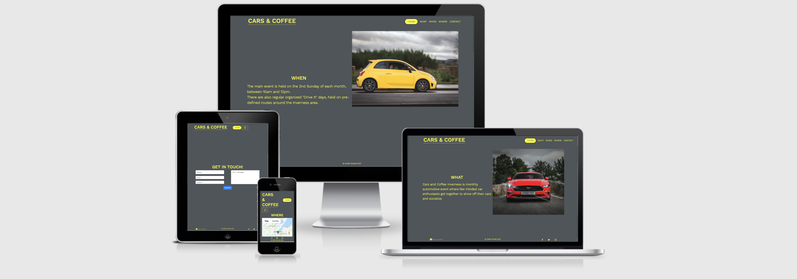

# CARS & COFFEE

Welcome to my Code Institute MS2 Project: Interactive Frontend Development.

## Wireframes, mockups and screenshots

## [Click to visit live demo site](https://vinnyshaw.github.io/cars-and-coffee-ci-ms2/#what-section)

## [Return to main README document](https://github.com/VinnyShaw/cars-and-coffee-ci-ms2/blob/master/README.md)

## Table of contents

- [Wireframes](https://github.com/VinnyShaw/cars-and-coffee-ci-ms2/blob/master/wireframes.md#wireframes)

- [Design alterations](https://github.com/VinnyShaw/cars-and-coffee-ci-ms2/blob/master/wireframes.md#design-alterations)

### Wireframes

#### Mobile, Tablet, Desktop

#### Design alterations

- **Theme toggle** - Text label used to give the user a clearer idea of the buttons function.
- **Theme** - A darker background-color used for higher contrast.
- **Logo** - "Inverness, Scotland" removed for a cleaner look.
- **WHEN section** - WHEN section given its own text area and image.
- **Get in touch!** - Contact link hidden on smaller screens for a cleaner look.
- **Get in touch!** - First name and Last name inputs combined for a cleaner look.
- **Get in touch!** - Image removed for a cleaner look.

## [Return to main README document](https://github.com/VinnyShaw/cars-and-coffee-ci-ms2/blob/master/README.md)
